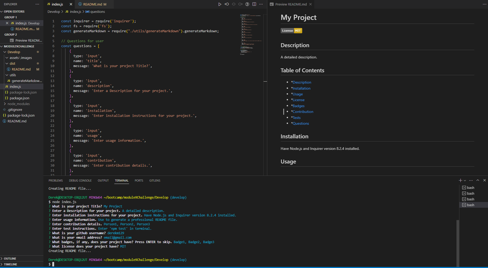

# Professional README Generator

## Description
- My motivation for this project was to create an application that can generate Professional README files based off of user input.
- I built this project using JavaScript, Node.js, and Inquirer version 8.2.4.
- This app streamlines the process of creating README files.
- I learned from making this application how to use multiple JS files in a project and the uses of Node.js and Inquirer.

## Installation
- This application needs Node.js and Inquirer version 8.2.4 to work correctly.
## Usage
- Enter 'node index.js' in terminal to start the program. Answers questions from the prompt to generate a professional README file. Generated file will appear in 'dist' folder.

## Credits
N/A

## License
N/A
